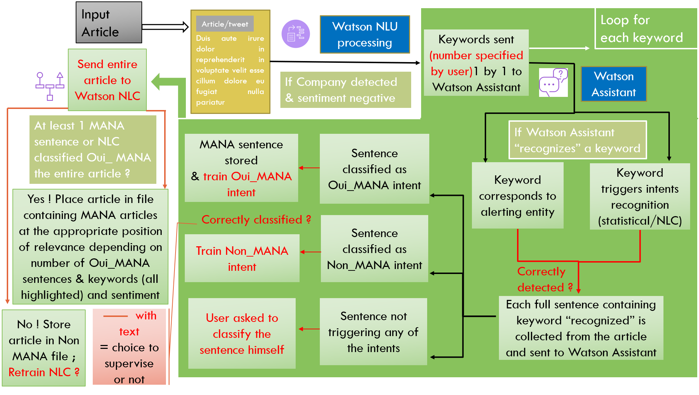
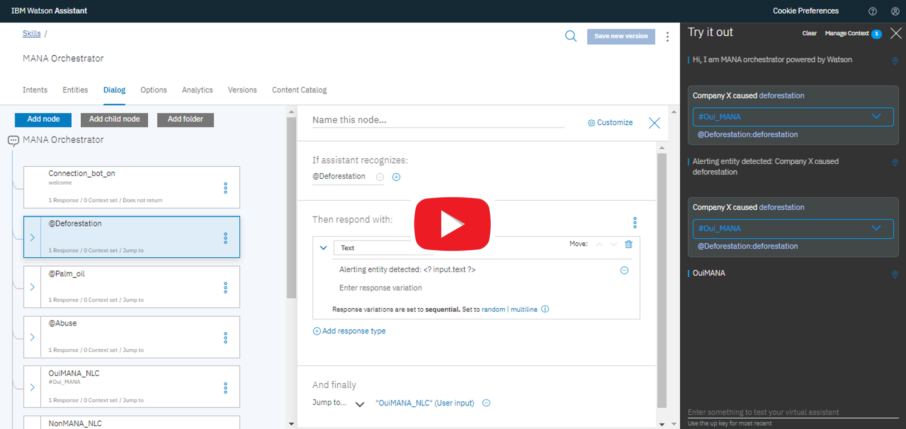
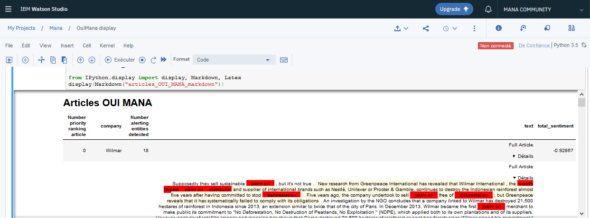

# AI for the Environment

Watson AI modules help MANA process thousands of articles to track and assess environmental impact of corporations.  With little initial training (less than 100 articles), a result of more than 90% of correct classification was achieved. 

How ? 
The specific architecture of this solution tailored for MANA leverages the interplay of Watson modules to achieve this optimized accuracy.

Below is a detailed step by step tutorial to invite you to run by yourself this Watson for MANA algorithm. No prior knowledge at all is expected. It is meant to be achievable by anyone as it is fully self explanatory, following the same pedagogical principle than for instance OpenClassroom.

Feel free to reuse and adapt this solution to tap into IBM Watson AI processing power within your own field. Create from it your own "Watson for good" use cases to serve purposeful causes, helping tackle other environmental or social challenges.

- [AI for the Environment - Watson for MANA](#ai-for-the-environment---watson-for-mana)
  - [Challenge definition](#Challenge-definition)
  - [A very general classification problem](#A-very-general-classification-problem)
  - [What is the solution ?](#What-is-the-solution-?)
    - [Preamble](#Preamble)
  - [Step by step guide to run the script](#Step-by-step-guide-to-run-the-script)
    - [First step : Create your IBM Cloud account for free](#First-step--create-your-IBM-Cloud-account-for-free)
  - [Watson Natural Language Understanding](#Watson-Natural-Language-Understanding)
    - [How to create your own Watson NLU instance](#How-to-create-your-own-Watson-NLU-instance)
  - [Watson Assistant](#Watson-Assistant)
  - [How to create your own Watson Assistant instance](#How-to-create-your-own-Watson-Assistant-instance)
  - [Watson Natural Language Classifier](#Watson-Natural-Language-Classifier)
  - [Watson Translator](#Watson-Translator)
  - [How to run the script](#How-to-run-the-script)
    - [How to run the script locally on your machine](#How-to-run-the-script-locally-on-your-machine)
  - [Follow the execution](#Follow-the-execution)
  - [How to adapt the script to create your own Watson for good use cases](#How-to-adapt-the-script-to-create-your-own-Watson-for-good-use-cases)
  - [Conclusion](#Conclusion)
  - [Improvements to come](#Improvements-to-come)
  - [Acknowledgments](#Acknowledgments)

    
## Challenge definition

MANA Vox aspires to be the First citizen platform to collect and valorize data assessing the impact of businesses/corporations on the environment on a global scale. 

Please visit their website at: 

How to achieve this goal ?

By treating/processing information (articles, tweets) coming from its unique Network made of:

1500 sources
in 80 languages

=> Enormous amounts of articles to read through

Problem: It is (linearly) costly in time for human beings to read the articles

Solution: Watson Artificial Intelligence processing power can dramatically reduce the workload 

## A very general classification problem

In practice this amounts to a very typical classification task.

In our case, "relevant" information is when environmental impact by a corporation (e.g. deforestation resulting from palm oil industry, etc..) is detected in an article. Irrelevant is when no such information is present in the article.

Now, the requirements of the solution to be designed were:
- As user friendly and transparent as possible insofar as MANA staff is non technical and not comfortable with looking at the code to understand its behaviour, make adaptations or tuning parameters by investigating themselves the output. 
- Highly customizable and monitorable. The aim was to be able to have levers instead of a pure black box model which would work very well only for articles on a specific topic dealt with in the training datasets but not able to adapt when tackling new topics.

To answer with anticipation, the final solution implemented: 
1) explicitly displays on the screen every single major processing done for the user to be able to understand/follow it
2) The final architecture keeps best flexibility possible by optimizing the trade off between the speed of learning and the scaling power of the pure ML approach

## What is the solution ?

This algorithm was specifically tailored for MANA in order to classify with highest accuracy articles content as relevant/non relevant information. It optimizes the classification by orchestrating efficiently the use of several IBM Watson AI.

Please look at the Power Point to better understand the underlying justification for this final solution architecture. It details the genesis of the reasoning, ideation process and trials that allowed to eventually settle after several adjustments to reach that final architecture.

Now, an additional feature of the script that did not fit in this overwhelming architecture schema:
One limitation in the keyword recognition is that alerting entities have to be pre-filled manually on Watson Assistant interface by the user. Those manually informed alerting entities aim to make sure 100% not to miss those words like deforestation, environmental destruction, etc... To compensate for the fact that the user may not be able to guess all relevant keywords he wants to fill as alerting entities (to make sure 100% not to miss those words, like deforestation, environmental destruction, etc...) on a given set of articles. A prospection function was added. This prospection function treats all articles and informs back of the most recurring keywords, as a suggestion for the user who might recognise some relevant keywords to be added. This function is all the more useful when alerting entities are within one field, for instance the theme of deforestation and all its synonyms. And that a new set of articles of another field are to be treated. For instance about river pollution. Then the user may want to prospect the articles to be given an idea of the relevant alerting entities to add.

Likewise at the end of the execution, all keywords associated to sentences which have just been classified and stored as relevant for MANA, are displayed. This allows the user to make observations about the alerting entities which are most relevant to keep in that they were most sollicited.

### Verbose Explanations on the big steps of the algorithm and the justification of the architecture

First and foremost, the raw text of the article is translated to English if necessary and sent to NLU.

Two basic primary filters are applied there from information extracted by NLU not to discard the article as irrelevant:
a company must have been detected and the overall sentiment (a pondered score of several tone indicators) must be negative.

Then, one by one all the keywords extracted from NLU are sent to Watson assistant.
In fact, as detailed in the PPT, a thorough preliminary study showed that the keywords were the most relevant information to get from NLU treatment of the article in the case of MANA.

Watson Assistant needs very little initial training (a matter of 5 minutes really) to be told some critical entities to detect : e.g. « deforestation », « palm oil expansion », etc…

Thus when Watson Assistant receives those keywords from Watson NLU, if a critical entity is recognised, it finds back the sentence(s) containing it. There are two possibilities : the sentence containing it in the article is either relevant/interesting for MANA, as e.g. : « Company X was accused of deforestation » or not relevant for MANA : « Company Y engaged against deforestation ».

This classification per say of the meaning is therefore performed by the intent, which is the NLC of the chatbot.
To rephrase it, when the keyword « deforestation » is sent from NLU and recognised as an entity by Watson Assistant, all sentences from the article containing “deforestation” are sent to be classified by the intent (NLC) as relevant or non relevant.

Now, for the very first few sentences, the intent is not trained yet, so human supervision helps classify the sentences containing “deforestation” in the article to train the intents « relevant » or « not relevant ». But as very few phrases are classified, the intents are able to recognize the sentences by themselves without the need for human confirmation.

This way of proceeding facilitates and hence speeds ups the training phase in that there is no need to ingest a previously labelled dataset. We can directly start with the articles at hand and are only asked to classify initially few sentences which contain words that we have filtered (through critical/alerting entities) to be interesting.

Furthermore, these two layers (entity detection and confirmation by the intent of the relevance of the sentence containing it) allows for future reliable unsupervised continuous learning : the intents training being by this process really fine tuned, when a new sentence containing an alerting entity – deforestation in our case – is detected, we can let with little risk this sentence be added as a training example sentence of the intent.

In any case, if ever one sentence was classified in the wrong class, it is very easy through the lean graphical interface of Watson Assistant to detect it and delete it from the training examples.

This flexibility and easy monitoring of the training is why we chose Watson Assistant over any other option.

#### What makes the trick

This architecture allows to implement a feature that becomes very advantageous : as the intents training is sufficient, they can start to recognize directly the keywords. In fact, say e.g. that many training sentences in the intents contain the mention of the “Indonesian rainforest”. Then it is very likely that if a keyword sent from NLU is « Indonesian » or « rainforest », which were not previously defined as alerting entities, it will be detected directly by the intents although it did not trigger entities detection.
The whole process would in this case be repeated: the sentences in the article containing indonesian or rainforest are sent again to those same intents for classification, to determine whether the whole sentence is relevant or not. This situation frequency will significantly increase (as opposed to mere alerting entity detection) as the intents get more and more trained.

Therefore, this combined use of the top performing AI bricks of Watson : namely keywords extraction from NLU plugged to an astute two fold classification by Watson Assistant, allows for a very fast training, which can moreover reliably be left to autonomous continuous learning, and overall easily monitored through Watson Assistant very practical user interface.
To rephrase in other words the strengths of the architecture of MANA text classification algorithm: keywords extraction (50 keywords are generated for an average three pages long article) allows efficient extraction of the main articles information, while Watson Assistant allows to keep the fine tuning of a sentence by sentence final classification (with an interesting control through the filter of entities).

All steps in the previously explained algorithm can be supervised or left unsupervised during execution:
•	Asking when an entity is detected whether it is relevant to do so. 
•	Asking whether a sentence was correctly classified by the intents. 
•	Asking whether the intent should be trained or not with this last classified sentence

There are also functions allowing to report the keywords that appeared most frequently in some articles in prospection, and as well systematically in the articles which have already been treated, so that the filter of alerting entities can be manually fine tuned in the light of those suggestions.

The result of this first treatment is that all relevant sentences in the article are stored and localized, which is far better than just classifying the entire article.

There are yet on this first part of the algorithm many possible improvements/fine tuning coming from a more extensive use of the information provided by NLU treatment of the article. This is especially true for the ordering of the relevant articles.

Namely, through testing phases it is possible to determine and adjust the weight to give to the emotions and sentiment, and to the « Company » entity detected at first as well. Also, the author/source might receive a weight, as well as possibly the confidence score of the enrichment.

Those are all very straightforward adaptations to make to the algorithm but take time to be tested for efficiency improvement. This is basically be an empiric fine tuning of parameters through testing.

All these parameters have to be given a weight to order the article.
Should the ordering be mostly based on ?
1.	how many sentences in total in the article were classified as relevant
2.	What were the emotion score attributed by NLU attached to the keywords in sentences classified as relevant
3.	The author source
4.	The location… (the location and company could also easily help to store the whole article in different files)
A weighted average of all of these probably, to determine through testing.

#### Watson independent NLC model in last resort

Yet, because it is possible that the keywords identified by NLU from the article do not trigger any alerting entity or intent detection from Watson assistant, the algorithm leverages the power of a pure NLC capability, simply through the API of Watson NLC service.

Watson NLC service is trained with all the example sentences in the intents of Watson Assistant (which are very accurate relevant sentences, hence of great training value), but also with the full raw text of the article already classified. By very essence of neural networks, its training is long and not practical to update nor monitor.
Yet, it is hoped to be more powerful when scaling, allowing to classify a whole unstructured text with more accuracy (through the multiple correlations it can draw with its training datasets) than Watson Assistant NLC. But its classification is expected to remain quite coarse compared to the sentence by sentence one of NLU + Watson Assistant.

In fact, it is essentially a black box: the correlations it draws from its training data to classify the raw text of the article as relevant or not can sometimes be extremely powerful or completely absurd, without us really knowing a priori.

#### Conclusion on the architecture

As a conclusion, it is important to note that the tailored orchestration of NLU + Watson Assistant and the black box NLC approach are not in competition, they are complementary:
NLU + Watson Assistant are fine tuned filters, able to detect relevant sentences. But even though they do not detect any, the entire article is in last resort sent to the black box NLC.

This black box NLC can be trained from scratched with raw text of all already classified articles. We can be legitimately be optimistic that in the long term it will start performing very well, having in the meantime benefitted strongly from the highly relevant training sentences of the intents of Watson Assistant.

### Preamble

If you are not already ackowledged with Watson modules, the following explanation of the architecture will not already appear understandable. In that case, I invite you either to consult the PPT which introduces each module and the terms/vocabulary associated to it, or the following sections which explain briefly what each module is capable of doing before guiding you practically with creating your own instances to be ble to run the script.

## Step by step guide to run the script

First and foremost you will need to instantiate several Watson modules.

Those instances can all be created entirely FOR FREE on IBM Cloud, giving you access for each module to about free 10 000 API calls to experiment by yourself, build your own POCs and demos.

### First step : Create your IBM Cloud account for free

Also download the file Instances_Watson_modules.py where we will insert your credentials as we instantiate the services.

## Watson Natural Language Understanding

In short, this module allows you to extract metadata, as attributes and indicators (which represent structured data) from an unstructured raw text. In particular, it provides you with: 
- Sentiment, Emotion
- Keywords
- Entities (referring to Locations, people, companies, etc...)
- Categories, Concepts
- Syntax
- Semantic Roles

Please consult the [demo page here](https://natural-language-understanding-demo.ng.bluemix.net/) to visualise by yourself what Watson NLU is capable of doing.

### How to create your own Watson NLU instance

Once you are logged in your IBM account, click on "Catalog" and the "AI section".
Scroll down to Naural Language Understanding and, after having set the region to deploy your service (Frankfurt in my case) you click on Create.

(Pictures here)

Now that you just created your instance, click on Manage and you can already copy the API Key and replace the appropriate field in the file Instances_Watson_modules.py. 

You just need to insert your own API Key (and url if it differs) instead of 'xxx' (keep quotes around) in the lines below :

naturalLanguageUnderstanding = NaturalLanguageUnderstandingV1(
    version='2018-11-16',
    iam_apikey='xxx',
    url='https://gateway-fra.watsonplatform.net/natural-language-understanding/api'
)

## Watson Assistant

General intro of what it's capable of and what you can do with it

I encourage you to learn how to design your own assistant with ... tutorial

### Why use Watson Assistant here ?

Watson Assistant is generally used for building chatbots. However, it can be used quite differently, as it is essentially composed of a Natural Language classifier (NLC) with classes defined as « intents ».

It also incorporates an exact word detection of so called « entities ».

The intents work essentially as NLC, namely they are able to classify new formulations of a sentence by extrapolating from previous training sentences with similar meaning. Watson has indeed been trained on thousands of articles in the web, among which many wikipedia articles. The entity are not NLC but just exact word recognition.

What makes Watson Assistant an extremely interesting fundamental brick to leverage is that it is one of the best performing assets in the market. The intent classification (NLC) is very competitive (with an aggressive roadmap of improvements as the product is hugely sold to industries) and it is very well embedded in a graphical user interface allowing to easily monitor the example sentences to train the intents and entities.

## How to create your own Watson Assistant instance

Analogously yo what we did above with Watson Natural Language undesrtanding, on the "AI" section of the "Catalog", you can create an instance of Watson Assistant (in Frankfurt in my case) and copy your API Key, which you can already insert in the file Instances_Watson_modules.py by replacing 'xxx' in the lines below:

assistant = watson_developer_cloud.AssistantV1(
    iam_apikey='xxx',
    version='2018-09-20',
    url='https://gateway-fra.watsonplatform.net/assistant/api'
)

Then click on launch Watson Assistant, then on the tab "Skills".
I invite you then to click on "create skill" and then "import skill".

For this project I invite you to import as a starting point the skill MANA_orchestrator.json. It has the right dialog structure, intent and entities definition and it was already trained with about 300 examples per intent. 
You are evidently welcome to make your own modifications to it.

Then click on Skills above and you should visualise your new imported skill called MANA orchestrator. Please click on the three vertical dots, 'view API details'. You shall then copy the workspace-id credentials and replace in the file Instances_Watson_modules.py the 'xxx' in the line:

workspace_id_assistant='xxx'

Hopefully, the video below should help you in the steps explained before of importing the skills. It also shows you a little exploration of the intents, entities, the dialog, and makes a little test to show you what are MANA Orchestrator responses according to the input.

## Watson Natural Language Classifier

This pure, external/independent Watson NLC service (not embedded in Watson Assistant) is built with a better scaling statistical model (neural network behind) than Watson Assistant. This capability was designed primarily to ingest and treat enormous amounts of data. It is less flexible than the intents/NLC in Watson Assistant, with significantly longer and less practical training procedures, but with the advantage of being able to draw more powerfully correlations when massive data is ingested and submitted to be classified. It is therefore best suited for raw text.

## How to create your own Watson NLC instance

Exactly same process as above, create from the catalog your instance (in Frankfurt in my case) and copy your own API Key (and url if it differs) instead of 'xxx' (keep quotes around) in the lines below in the file Instances_Watson_modules.py:

natural_language_classifier = NaturalLanguageClassifierV1(
    iam_apikey='xxx',
url='https://gateway-fra.watsonplatform.net/natural-language-classifier/api')

## Watson Translator

No need to explain hopefully what the translator does. We will need it to treat articles from 80 languages for MANA ! 
Again same process, just create an instance and copy your own API Key (and url if it differs) instead of 'xxx' (keep quotes around) in the lines below in the file Instances_Watson_modules.py:

language_translator = LanguageTranslatorV3(
version='2018-05-01',
url='https://gateway-fra.watsonplatform.net/language-translator/api',
iam_apikey='xxx'
)

## How to run the script

Now that you have updates the file Instances_Watson_modules.py with your own credentials (API Keys for each module instance), you are ready to run the script.

I suggest you start by running it locally. This is easier and allows to assess the results of the solution by yourself.

Once you understand how the script works and trust its performance, I will explain to you how to run a much more compact version directly on IBM Cloud, through what is called a "Cloud function". This is what MANA Vox is currently doing.

### How to run the script locally on your machine

1) Install a Python interpreter if not already the case (Anaconda will do great, and includes the Spyder IDE which comes handy)
2) Install Watson packages by running on the terminal (command line called cmd on Windows): pip install --upgrade ibm-watson (or on windows: py -m pip install ibm_watson)
3) Save the scripts on a folder, along with the excel file containing the articles to be treated.
4) On the terminal run the script with the command:
On Linux and MacOS: python script_name
On Windows: py script_name
5) In case you want to stop the script before the end of its execution, type Ctrl+C as the scrit is running on the terminal. All information from articles that had already been processed until that point will then be stored (without any loss) in the appropriate files OuiMANA and NonMANA.

## Follow the execution

A great care was taken such that all that the script does which is interesting for you to understand and follow, is displayed on the terminal during the execution. 

You are invited at the beginning to define your supervision settings, and the number of keywords from NLU that are to be considered.

Let's detail here what is done during this execution:
As you have probably already understood from the previous explanation of the architecture, the entities of the chatbot are 

## How to adapt the script to create your own “Watson for good” use cases

## How to visualise the final result

### The "easy but limited" way

To visualize the final result, you can either use the vba macro from the excel file "Visualisation Articles Watson fro MANA.xlsm. In fact by running the macro "load MANA articles", or the shortcut Ctrl + Shift + L, all articles which are stored in your .tsv file will loaded and displayed in a neat column formatted. Important for the macro to work is that the excl file is in the same folder as your .tsv files.

### The "harder but nicer" way

 I invite you to run the notebook in Watson Studio to display all articles inthe nicest way.
 In fact, as you can observe in the video below, which shows the process to do so, you will be able at the end to recover the full texts with relevant sentences and keywords highlighted directly (instead of stored in separate columns in the excel files).
 An additional advantage allowed by this display noebook is the scroll down that allows you to only see the full texts of the articles you are interestes in, and not necessarily all texts as in Excel.
 

### What is Watson Studio and how to create your account ?

## Conclusion

As you were hopefully able to experiment by yourself, the solution performance, speed of training, and flexibility was achieved by leveraging in a complex architecture several Watson modules.
Not only has it answered the initial challenge of classifying with accuracy text articles, it is also capable of directly indicating in the classified text where are the sentences containing relevant information.

This enables saving time for MANA to supervise and check that the articles were correctly classified, and to the end user of this information who can also directly go to the point.

## Improvements to come

### Watson Knowledge Studio

An additional capability named Watson Knowledge Studio (WKS) could be plugged at the level of the information returned by NLU that. WKS allows to create custom entities to be recognised by NLU. This becomes really interesting if we want to detect specific/technical vocabulary that would not be recognised by NLU. If we treat articles about chemicals polluting rivers for instance, and that specific chemicals are not recognised as keywords by the semantic analysis of NLU because they are not particularly emphasized in the article, but that we do not want to miss them. Then training a custom entity to detect chemicals (by the semantic position in the sentence) with WKS could be relevant. 

### Watson Discovery Service

WDS is in short a search engine (like Google’s famous one for instance) on your own data that you store. In particular, plugging it could help searching efficiently in the training example sentences of the intents of Watson Assistant. If you quickly want to do a specific search, on a location, on a company, on anything really in the sentences classified as relevant, then WDS would be particularly easy to implement (a matter of few minutes to code). 

### Watson Openscale

Watson Openscale is able to be plugged on blackbox models and give elements of explanation on their behaviour. In particular, on a raw text, Openscale can determine which words made the black box model opt for a specific class or another.  This would therefore be a great way to assess how our NLC, which is essentially a black box raw text classifier, is performing - in order to know how much we can trust it. It should be borne in mind though that, conversely to the training sentences of the intents in Watson Assistant which can be removed if we notice that they were misclassified, we could not (even with Watson Openscale plugged explaining the classification) correct so easily the blackbox NLC.

In the particular case of Watson NLC, a technical specification limits its relevance: only the first 1000 characters of the raw text of the article can be ingested as an training example for the class.

Thus, to be able to ingest the full article text, it may be relevant to experiment with implementing state of the art open source libraries for Random Forest classification, or Convolutional Neural Network.
IBM very recently released NeuNetS, a Convolutional Neural Network synthesizer, which could also be tested in that case.

### Development of an OpenSource NLC model

Alexandre Berthet, data scientist at IBM, and I, will explore the implementation of an OpenSource NLC model that is hoped to overcome some previously alluded limitations of Watson NLC. Among others, the Tech for Good enthusiasts community will be sollicited for that purpose.

## Acknowledgments

On IBM side, thanks to Ramzi ben Ouagram and Vincent Perrin for allowing the project to develop. Thanks to Alexandre Berthet who supported actively the practical implementation for MANA of this solution, and is working on the improvement to bring it to next level.
On MANA side, thanks to Gabrielle Garmier and Capucine Lebois for their energy and pedagogy in co-desigining this solution together.
