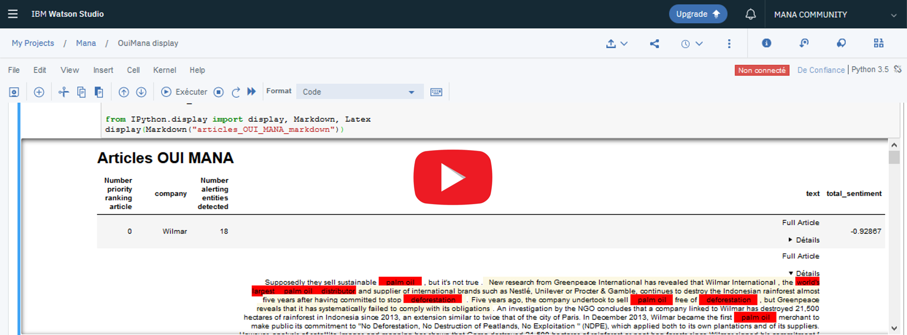

#          Machine Learning used to preserve the Environment


**Watson AI modules help MANA process thousands of articles to track and assess environmental impact of corporations.  With little initial training (about 100 articles), a result of more than 80% of correct classification was achieved on test datasets.**

##### How ? 
The specific architecture of this solution tailored for MANA leverages the interplay of Watson modules to achieve this optimized accuracy.

*Below is a detailed step by step tutorial to invite you to run by yourself this Watson for MANA algorithm. No prior knowledge at all is expected. It is meant to be achievable by anyone as it is fully self explanatory, following the same pedagogical principle than for instance OpenClassroom approach.*

##### Open sourced !

Feel free to reuse and adapt this solution to tap into IBM Watson AI processing power within your own field. Create from it your own "Watson for good" use cases to serve purposeful causes, helping tackle other environmental or social challenges.


- [Machine Learning used to preserve the Environment](#Machine-Learning-used-to-preserve-the-Environment)
        - [How ?](#How-?)
        - [Open sourced !](#Open-sourced-!)
  - [Challenge definition](#Challenge-definition)
        - [How to achieve this goal ?](#How-to-achieve-this-goal-?)
  - [A very general classification problem](#A-very-general-classification-problem)
      - [Technical specifications from MANA](#Technical-specifications-from-MANA)
  - [What is the solution ?](#What-is-the-solution-?)
    - [Preamble](#Preamble)
    - [The architecture](#The-architecture)
    - [Verbose Explanations of the big steps of the algorithm & the justification of the architecture](#Verbose-Explanations-of-the-big-steps-of-the-algorithm-&-the-justification-of-the-architecture)
      - [Why is this two-fold classification process with Watson Assistant convenient and powerful ?](#Why-is-this-two-fold-classification-process-with-Watson-Assistant-convenient-and-powerful-?)
      - [The trick: not only entities can be detected at first by Watson Assistant](#The-trick:-not-only-entities-can-be-detected-at-first-by-Watson-Assistant)
      - [Supervision](#Supervision)
      - [Overcoming the limitations of Watson Assistant entities](#Overcoming-the-limitations-of-Watson-Assistant-entities)
      - [Why ?](#Why-?)
      - [Conclusion of this first part (the loop on the diagram): the power of sentence by sentence classification](#Conclusion-of-this-first-part-(the-loop-on-the-diagram):-the-power-of-sentence-by-sentence-classification)
      - [Watson independent NLC model in last resort](#Watson-independent-NLC-model-in-last-resort)
      - [Conclusion on the architecture](#Conclusion-on-the-architecture)
  - [Step by step guide to run the script](#Step-by-step-guide-to-run-the-script)
    - [First step : Create your IBM Cloud account for free](#First-step-:-Create-your-IBM-Cloud-account-for-free)
  - [Watson Natural Language Understanding](#Watson-Natural-Language-Understanding)
    - [How to create your own Watson NLU instance](#How-to-create-your-own-Watson-NLU-instance)
  - [Watson Assistant](#Watson-Assistant)
      - [Side note for those still wondering why we use Watson Assistant for this classification problem ?](#Side-note-for-those-still-wondering-why-we-use-Watson-Assistant-for-this-classification-problem-?)
  - [How to create your own Watson Assistant instance](#How-to-create-your-own-Watson-Assistant-instance)
    - [Import the MANA Orchestrator skill](#Import-the-MANA-Orchestrator-skill)
    - [A Video to guide you in case](#A-Video-to-guide-you-in-case)
  - [Watson Natural Language Classifier](#Watson-Natural-Language-Classifier)
  - [How to create your own Watson NLC instance](#How-to-create-your-own-Watson-NLC-instance)
  - [Watson Translator](#Watson-Translator)
  - [How to run the script](#How-to-run-the-script)
    - [How to run the script locally on your machine](#How-to-run-the-script-locally-on-your-machine)
  - [Follow the execution](#Follow-the-execution)
      - [Let's detail here what is done during this execution:](#Let's-detail-here-what-is-done-during-this-execution:)
      - [Some more explanations on the input file](#Some-more-explanations-on-the-input-file)
        - [Why proceed that way ? (As if it were a test set)](#Why-proceed-that-way-?-(As-if-it-were-a-test-set))
        - [Now, let us come back to the execution:](#Now,-let-us-come-back-to-the-execution:)
    - [The end of the execution](#The-end-of-the-execution)
      - [Important advice here](#Important-advice-here)
      - [Personal technique](#Personal-technique)
  - [Is your solution well trained enough ? Ready to deploy it as a Cloud function !](#Is-your-solution-well-trained-enough-?-Ready-to-deploy-it-as-a-Cloud-function-!)
  - [How to adapt the script to create your own Watson for good use cases](#How-to-adapt-the-script-to-create-your-own-Watson-for-good-use-cases)
  - [How to visualise the final result](#How-to-visualise-the-final-result)
    - [The "easy but limited" way](#The-"easy-but-limited"-way)
    - [The "harder but nicer" way](#The-"harder-but-nicer"-way)
      - [What is Watson Studio and how to create your account ?](#What-is-Watson-Studio-and-how-to-create-your-account-?)
      - [How does it look then ?](#How-does-it-look-then-?)
  - [Conclusion](#Conclusion)
  - [Improvements to come](#Improvements-to-come)
    - [Watson Knowledge Studio](#Watson-Knowledge-Studio)
    - [Watson Discovery Service](#Watson-Discovery-Service)
    - [Watson Openscale](#Watson-Openscale)
    - [Development of an OpenSource NLC model](#Development-of-an-OpenSource-NLC-model)
  - [Acknowledgments](#Acknowledgments)


    
## Challenge definition

MANA Vox aspires to be the First citizen platform to collect and valorize data assessing the impact of businesses/corporations on the environment on a global scale. 

Please visit their [website here](https://www.mana-vox.org/) !

##### How to achieve this goal ?

By treating/processing information (articles, tweets) coming from its unique Network made of:

- 1500 sources
- in 80 languages

This implies enormous amounts of articles to read through.

> Problem: It is (linearly) costly in time for human beings to read the articles

**Solution: Watson Artificial Intelligence processing power can dramatically reduce the workload**

## A very general classification problem

In practice this amounts to a very typical classification task.


In our case, "relevant" information is when environmental impact by a corporation (e.g. deforestation resulting from palm oil industry, etc..) is detected in an article. Irrelevant is when no such information is present in the article.

#### Technical specifications from MANA

The requirements of the solution to be designed were:

- As user friendly and transparent as possible insofar as MANA staff is non technical and not comfortable with looking at the code to understand its behaviour, make adaptations or tune parameters by running tests as data scientists would to investigate the effects on the output. 
- Highly customizable and monitorable. The aim was to be able to have levers instead of directly a pure black box model which would work very well only for articles on a specific topic dealt with in the training datasets but not able to adapt when tackling new topics.

To answer with anticipation, the final solution implemented with Watson: 
1) Explicitly displays on the screen every single major processing step done for the user to be able to understand/follow it
2) The final architecture keeps best flexibility possible given the above constraints by optimizing the trade off between the speed of learning and the scaling power of the pure ML approach

## What is the solution ?


### Preamble

If you are not already ackowledged with Watson modules, the following explanation of the architecture will not already appear readily understandable. In that case, I invite you either to consult the [PPT on the rationale](MANA_rationale.pptx)  which introduces each module and the terms/vocabulary associated to it, or be introduced through the following sections which explain briefly what each module is capable of doing before guiding you practically in creating your own instances to be able to run the script.

### The architecture

This algorithm architecture was specifically tailored for MANA in order to classify with highest accuracy articles content as relevant/non relevant information. It optimizes the classification by orchestrating efficiently the use of several IBM Watson AI modules.


If you are interested in the underlying reasoning that led to this final algorithm, I refer you again to the [PPT on the rationale](MANA_rationale.pptx) which details the genesis of the ideation process and trials that allowed to eventually reach, after several adjustments, this specific final architecture.

### Verbose Explanations of the big steps of the algorithm & the justification of the architecture

First and foremost, the raw text of the article is translated to English if necessary and sent to NLU.

Two basic primary filters are applied there from the information extracted by NLU to determine whether to discard directly the article as irrelevant:
1) A company must have been detected 
2) The overall sentiment (a pondered score of several sentiment indicators) must be negative.

Then, one by one all the keywords extracted from NLU are sent to Watson assistant.
In fact, as detailed in the [PPT on the rationale](MANA_rationale.pptx), a thorough preliminary study showed that the keywords were the most relevant information to get from NLU treatment of the article in the case of MANA.

Watson Assistant needs very little initial training (a matter of 5 minutes really) to be told some elementary rules : the critical entities to detect e.g. « deforestation », « palm oil expansion », etc…

Thus when Watson Assistant receives those keywords from Watson NLU, if a critical entity is recognised, it finds back the sentence(s) containing it in the original articles. From there, there are two possibilities : the sentence containing it in the article is either relevant/interesting for MANA, as e.g. : « Company X was accused of deforestation » or not relevant for MANA : « Company Y engaged against deforestation ».

This classification per say of the meaning is therefore performed by the intent, which is the classifier (NLC) of the Watson Assistant (synonymous of "chatbot").

To rephrase it, when the keyword « deforestation » is sent from NLU and recognised as an entity by Watson Assistant, all sentences from the article containing “deforestation” are sent to be classified by the intent (NLC) as relevant or non relevant.

At the real beginning, when the intents are not trained yet, the algorithm does ask during execution for some initial human supervision to help classify those very first few sentences containing “deforestation” in the article, in order to train the intents « relevant » or « not relevant ». But as very few phrases are classified, the intents are then able to recognize the sentences by themselves without the need for human confirmation, although supervision is encouraged to ensure this early autonomous classification is correct.

#### Why is this two-fold classification process with Watson Assistant convenient and powerful ?

This way of proceeding facilitates and hence speeds ups the training phase in that there is no need to ingest a previously labelled dataset. We can directly start with the articles at hand and are only asked to classify initially few sentences which contain words that we have filtered (through critical/alerting entities) to be interesting. 

Furthermore, these two layers (entity detection and confirmation by the intent/class of the relevance of the sentence containing it) allows for **future relatively reliable unsupervised continuous learning : the intents training being by this process quite fine tuned, when a new sentence containing an alerting entity – deforestation in our case – is detected, we can let with little risk this sentence be added as a training example sentence of the intent.**

In any case, if ever one sentence was classified in the wrong class, it is very easy through the lean graphical interface of Watson Assistant to detect it and delete it from the training examples.

This flexibility and easy monitoring of the training is why we chose Watson Assistant over any other option.

#### The trick: not only entities can be detected at first by Watson Assistant

This architecture allows to implement a feature that becomes very advantageous : as the intents training is sufficient, they start to be directly triggered by the keywords. In fact, say e.g. that many training sentences in the intents contain the mention of the “Indonesian rainforest”. Then it is very likely that if a keyword sent from NLU is « Indonesian » or « rainforest », which were not previously defined as alerting entities (as deforestation), it will be detected directly by the intents although it did not trigger entities detection.
In this case, the whole process is repeated: the sentences in the article containing "indonesian" or "rainforest" are sent again to those same intents for classification, to determine whether the whole sentence is relevant or not. This situation frequency increases significantly (as opposed to mere alerting entity detection) as the intents get more and more trained.

Therefore, this combined use of the top performing AI bricks of Watson : namely keywords extraction from NLU plugged to an astute two fold classification by Watson Assistant, allows for a very fast training, which can moreover reliably be left to autonomous continuous learning, and overall easily monitored through Watson Assistant very practical user interface.

Let's rephrase in other words the strengths of the architecture of MANA text classification algorithm: 
keywords extraction (50 keywords are generated for an average three pages long article) allows efficient extraction of the main articles information, while Watson Assistant allows to keep the fine tuning of a sentence by sentence final classification (with an interesting control through the filter of entities).

#### Supervision

All steps in the previously explained algorithm can be supervised or left unsupervised as it starts during execution by:
- Asking when an entity is detected whether it is relevant to do so. 
- Asking whether a sentence was correctly classified by the intents. 
- Asking whether the intent should be trained or not with this last classified sentence

There are on this first part of the algorithm possible fine tuning improvements coming from a more extensive use of the information provided by NLU treatment of the article, which is especially true for the final ordering of the relevant articles kept in their priority ranking.
Namely, through tests it is possible to determine and adjust for this priority ranking the weights to give to the sentiment scores of the relevant sentences classified, and to the « Company » entity detected at first as well. Also, possible ideas to explore are to attribute a weight to the author/source.

Those are all very straightforward adaptations to make to the algorithm but take time to be tested for efficiency improvement. This is basically be an empiric fine tuning of parameters through testing.

All these parameters have to be given a weight to order the article.

Should the final priority ordering be mostly based on ?
1.	How many sentences in total in the article were classified as relevant
2.	What were the emotion score attributed by NLU attached to the keywords in sentences classified as relevant
3.	The author source
4.	The location… (the location and company could also easily help to store the whole article in different files)

A weighted average of all of these probably, to determine through testing...

Or those weights could be dynamically updated as a human supervises and reorders manually the final list proposed. The weights would adjust automatically to be able to account for this ordering (as well as the past ones).

#### Overcoming the limitations of Watson Assistant entities

Here I will explain some additional functions implemented to allow to report the keywords that appeared most frequently in some articles in prospection, as well as systematically in the articles which have already been treated, to help the filter of alerting entities to be (manually) fine tuned in the light of those suggestions.

#### Why ? 

In fact, one limitation in the keyword recognition by Watson Assistant is that alerting entities have to be pre-filled manually (on Watson Assistant interface) by the user. Those manually informed alerting entities aim to make sure 100% not to miss those words like deforestation, environmental destruction, etc... 

To compensate for the fact that the user may not be able to guess all relevant keywords to fill as alerting entities on a given set of articles, a prospection function was added. This prospection function treats all articles and informs back of the most recurring keywords, as a suggestion for the user who might recognise some alerting entities to be added. 

This function is all the more useful when alerting entities are within one field, for instance the theme of deforestation and all its synonyms. Then when a new set of articles of another field are to be treated, for instance about river pollution, the user can leverage this prospection of keywords of the new articles to be given suggestions of the relevant alerting entities to add that he may not have anticipated.

Likewise at the end of the execution, all keywords associated to sentences which have just been classified and stored as relevant for MANA, are displayed. This also allows the user to make observations about the alerting entities which are the most relevant to keep in that they were the most frequent in sentences classified as relevant.

#### Conclusion of this first part (the green box of the "loop for each keyword" on the diagram): the power of sentence by sentence classification

The result of this first treatment is that all relevant sentences in the article are stored and localized, which is a more interesting outcome than just classifying the entire article.

#### Watson independent NLC model in last resort

Yet, considering the scalability but also because it is possible that the keywords identified by NLU from the article do not trigger any alerting entity or intent detection from Watson assistant, the algorithm leverages the power of a pure NLC capability through the API of Watson NLC service. Even though NLU + Watson Assistant do not detect any relevant sentences, the entire article is in last resort sent to the black box NLC.

Watson NLC service is trained with all the example sentences in the intents of Watson Assistant (which are very accurate relevant sentences, hence of great training value), but also with the full raw text of the article already classified. This redundance between the relevant sentences taken from the intents and the full articles contents already containing them, helps "guide the model" towards learning what really makes an article relevant. Watson NLC promises better scalability and performance by essence of its neural network structure, but its costly training and practical difficulty to retrain, update nor monitor, limits its performance.

However, neural network NLC models can be expected to be more powerful when scaling, allowing to classify a whole unstructured text with more accuracy (through the multiple correlations it can draw with its training datasets) than the embedded classifier in Watson Assistant through its intents. 

As of the current situation, the classification of Watson NLC is quite coarse compared to the sentence by sentence one of NLU + Watson Assistant. In fact, it behaves essentially as a black box: the correlations it draws from its training data to classify the raw text of the article as relevant or not can sometimes be extremely powerful or completely absurd, without us really knowing a priori.
Furthermore, until a substantial size of the training dataset is reached, its performance remains very limited.


#### Conclusion on the architecture

As a conclusion, it is important to note that the tailored orchestration of NLU + Watson Assistant and the black box NLC approach are not in competition, they are completely complementary:

NLU + Watson Assistant are fine tuned filters, able to detect relevant sentences, while the black box NLC is used as a final layer taking as an input the full article.

This last resort black box NLC can be trained from scratch with raw text of all already classified articles. We can be legitimately be optimistic that in the long term it will start performing very well, having in the meantime benefitted strongly from the highly relevant training sentences of the intents of Watson Assistant.


## Step by step guide to run the script

First and foremost you will need to instantiate several Watson modules.

Those instances can all be created entirely FOR FREE on IBM Cloud, giving you access for each module to about 10 000 API free calls to experiment by yourself, to build your own POCs and demos.

### First step : Create your IBM Cloud account for free

Please create an account by clicking here on [IBM Cloud](https://www.ibm.com/cloud/).

Please download all the files of this repository, and in particular be ready to edit the file named Instances_Watson_modules.py where we will insert your credentials as we instantiate each of the Watson modules.

## Watson Natural Language Understanding

In short, this module allows you to extract metadata, as attributes and indicators (which represent structured data) from an unstructured raw text. In particular, it provides you with:

- Sentiment, Emotion
- Keywords
- Entities (referring to Locations, people, companies, etc...)
- Categories, Concepts
- Syntax
- Semantic Roles

Please consult the [demo page here](https://natural-language-understanding-demo.ng.bluemix.net/) to quickly explore and visualise by yourself what Watson NLU is capable of doing.

### How to create your own Watson NLU instance

Once you are logged in your IBM account, click on "Catalog" and the "AI section".

Scroll down to Naural Language Understanding and, after having set the region to deploy your service (Frankfurt in my case) you click on Create.

Now that you just created your instance, click on Manage and you can already copy the API Key and replace the appropriate field in the file Instances_Watson_modules.py. 

For this, you just need to insert your own API Key (and url if it differs) instead of 'xxx' (keep quotes around) in the lines below:

```
naturalLanguageUnderstanding = NaturalLanguageUnderstandingV1(
    version='2018-11-16',
    iam_apikey='xxx',
    url='https://gateway-fra.watsonplatform.net/natural-language-understanding/api'
)
```

## Watson Assistant

Watson Assistant is one of the most advanced chatbots module out there, being leveraged by an enormous range of clients worldwide.
I encourage you to learn how to design and run your own chatbot in few minutes with this [very practical and fast tutorial](https://cognitiveclass.ai/courses/how-to-build-a-chatbot/) .

#### Side note for those still wondering why we use Watson Assistant for this classification problem ?

Watson Assistant is generally used for building chatbots. However, it can be used quite differently, as it is essentially composed of a Natural Language classifier (NLC) with classes defined as « intents ».

It also incorporates an exact word detection of so called « entities ».

The intents work essentially as a classifier, namely they are able to recognize the intentions/meaning of a new sentence by extrapolating from previous training sentences with close meaning. Watson has indeed been trained on thousands of articles in the web, among which many wikipedia articles. 

The entities are not classifiers but just an exact word recognition.

What makes Watson Assistant an extremely interesting fundamental brick to leverage is that it is one of the best performing assets in the market. The intent classification is relatively very competitive (with an aggressive roadmap of improvements as the product is sold massively to demanding clients worldwide, corporations and startups) and it is very well embedded in a graphical user interface allowing to easily monitor the example sentences to train the intents and entities.


## How to create your own Watson Assistant instance

Analogously to what we did above with Watson Natural Language undesrtanding, on the "AI" section of the "Catalog", you can create an instance of Watson Assistant (in Frankfurt in my case) and copy your API Key, which you can already insert in the file Instances_Watson_modules.py by replacing 'xxx' in the lines below:

```
assistant = watson_developer_cloud.AssistantV1(
    iam_apikey='xxx',
    version='2018-09-20',
    url='https://gateway-fra.watsonplatform.net/assistant/api'
)
```


Then click on launch Watson Assistant, then on the tab "Skills".
I invite you then to click on "create skill" and then "import skill".

### Import the MANA Orchestrator skill

For this project I invite you to import as a starting point the skill MANA_orchestrator.json. It has the right dialog structure, intent and entities definition and it was already trained with about 300 examples per intent. 

You are evidently welcome to make your own modifications to it.

Then click on Skills above and you should visualise your new imported skill called MANA orchestrator. Please click on the three vertical dots, 'view API details'. You shall then copy the workspace-id credentials and replace in the file Instances_Watson_modules.py the 'xxx' in the line:

`workspace_id_assistant='xxx'`

### A Video to guide you in case

Hopefully, the video below should help you in the steps explained before of importing the skills. It also shows you a little exploration of the intents, entities, the dialog, and makes a little test to show you what are MANA Orchestrator responses according to the input.

Don't forget that Watson Assistant is here directly interfaced with the algorithm, such that the above demo shown where a user types in sentences to the "Try it" chatbot interface to explore its responses, is quite artificial.

[](https://youtu.be/VR6GGreDdQ8)

## Watson Natural Language Classifier

This pure, external/independent Watson NLC service (not embedded in Watson Assistant) is built with a better scaling statistical model (neural network behind) than Watson Assistant. This capability was designed primarily to ingest and treat enormous amounts of data. It is less flexible than the intents/NLC in Watson Assistant, with significantly longer and less practical training procedures, but with the advantage of being able to draw more powerfully correlations when massive data is ingested and submitted to be classified. It is therefore best suited for raw text.

## How to create your own Watson NLC instance

Exactly same process as above, create from the catalog your instance (in Frankfurt in my case) and copy your own API Key (and url if it differs) instead of 'xxx' (keep quotes around) in the lines below in the file Instances_Watson_modules.py:

```
natural_language_classifier = NaturalLanguageClassifierV1(
    iam_apikey='xxx',
url='https://gateway-fra.watsonplatform.net/natural-language-classifier/api')
```

Update note: IBM has removed the Lite Free plan for Watson NLC.
Therefore, if you do not have access to credentials and do not want to pay, I invite you to slightly alter two parts of the Main_Watson_for_MANA.py executable file:
1) Remove line 14: `natural_language_classifier=Instances_Watson_modules.natural_language_classifier`
2) Correct line 276 by replacing `if NLC=="Y":` by e.g. `if NLC=="Never"`, and obviously not typing "Never" when asked if you want to send the article to NLC. 


## Watson Translator

No need to explain hopefully what the translator does. We will need it to treat articles from 80 languages for MANA ! 

Again same process, just create an instance and copy your own API Key (and url if it differs) instead of 'xxx' (keep quotes around) in the lines below in the file Instances_Watson_modules.py:

```
language_translator = LanguageTranslatorV3(
version='2018-05-01',
url='https://gateway-fra.watsonplatform.net/language-translator/api',
iam_apikey='xxx'
)
```

## How to run the script

Now that you have updated the file Instances_Watson_modules.py with your own credentials (API Keys for each module instance), you are ready to run the script !

**I suggest you start by running it locally. This is easier and allows to assess the results of the solution by yourself.**

Once you understand how the script works and trust its performance and have been able to train Watson Assistant intents well enough, I will then invite you to run a much more compact version directly on IBM Cloud, through what is called a "Cloud function". This is what MANA Vox is currently doing.

### How to run the script locally on your machine

1) Install a Python interpreter if not already the case (Anaconda will do great, and includes the Spyder IDE which comes handy)
2) Install Watson packages by running on the terminal (command line called cmd on Windows): `pip install --upgrade ibm-watson (or on windows: py -m pip install ibm_watson)`
3) Save the three scripts called  `Main_Watson_for_MANA.py`, `Functions_Watson_for_MANA.py` and obviously `Instances_Watson_modules.py` which you have already been filling with your credentials, in the same folder, along with the excel file `file_articles.xls` containing the articles to be treated.
4) Run the script in the terminal with the command:

On Linux and MacOS: `python Main_Watson_for_MANA.py`

On Windows: `py Main_Watson_for_MANA.py`

5) In case you want to stop the script before the end of its execution, type `Ctrl+C` or `Cmd+C` while the script is running on the terminal. All information from articles that had already been processed until that point will then be stored (without any loss) in the appropriate files `Oui_MANA_articles.tsv` and `Non_MANA_articles.tsv` (which will have been created during the first execution if they were did not exist yet, or updated with the new articles if they were present as they stored articles already classified in the past).

## Follow the execution

A great care was taken such that all that the script is doing which can be interesting for you to understand and follow, is displayed on the terminal during the execution. 

Please click on the laptop below to see a video of a local execution of the script in the terminal of my own machine.

[](https://youtu.be/XQkW0PayBgk)

#### Let's detail here what is done during this execution: 

As you have hopefully already read from the previous explanation of the architecture, the entities of the chatbot need to be filled manually. In order to help the user anticipate which alerting entities are to be filled, a prospection function is first offered to analyse new articles and suggest which were the most recurring keywords that appeared.

In this execution right above on the video, the prospection function is run with the file containing the articles, called file_articles.xls.

#### Some more explanations on the input file

If you take a closer look at the input file (file_articles.xls), you will notice that it contains 20 articles (from line 0 to 19) on the first column – named A – and on right next to each article on the B column are Booleans 0 or 1 indicating if the article is relevant or not. This 0 or 1 corresponds to the answer of the correct classification, prelabeled by the human. 

##### Why proceed that way ? (As if it were a test set) 

It's of course a typical test in order to determine how well it performs !

Yet here, there is not a clear distinction to be made between training and testing sets. In fact, during the execution, we train the intents of Watson Assistant with relevant sentences from the article, and then finally test if the the final classification of the article concurs with what is correct (relevant or not) as indicated by the boolean on the B column.
To refresh your memory, if at least one sentence was classified as relevant for MANA by Watson Assistant, the article is kept relevant, which we compare to column B – which should be 1 for a relevant article.


##### Now, let us come back to the execution:

Once the prospection on keywords is done (if the user wanted to do it as it is optional) and the file & cells to be treated are indicated, all supervision settings are then asked to be defined by the user.

Please come back in the [architecture schema](the-architecture) to red annotated arrows and text to visualize that you have control over:

1)	Whether you want to confirm each time if it is correct for Watson Assistant to be detecting a specific alerting entity. Answer N for No if you trust your entities settings on Watson Assistant interface. Still, if you are experimenting with them, although confirmation may be tedious at the beginning, it truly allows you to observe which entities are most detected and reflect whether it is relevant to keep them. If you want to remove an entity detection from Watson Assistant, simply go on Watson Assistant entity interface as shown previously in the demo video of Watson Assistant, and make your adjustments directly from there. 
2)	Whether you want to confirm each time if a classification by Watson Assistant intents was correct or not. This is a crucial supervision that you may want to keep in the early stages and even later on to check that the intents classification is behaving well enough. Again coming back to the architecture schema, you can see that it is this step that determines whether a sentence is kept as relevant or not. It is where the classification operates, and it is crucial for the accuracy to make sure this classification is performing correctly.
3)	Following the last point is the training of the intents with this same sentence just classified. If the classification was correct, then no problem obviously. If it was not, training with this wrong sentence will strengthen the future mistakes. It is therefore advocated to be supervising point 2) at the beginning, in which case no need to supervise 3).
4)	In case you do not want to send the article in last resort to Watson NLC (or that you have issues with your instance), you can keep this supervised and will be asked at each execution. A remark here is that in the current version of the code, even though one sentence at least was classified as relevant for MANA by Watson Assistant, the article is still sent to Watson NLC. In fact, it still allows to compare the results. As explained previously, Watson NLC classification on the whole text is still expected to be more coarse than Watson Assistant sentence by sentence classification. This is implicitly why Watson NLC was kept for now only in last resort, in case Watson Assistant did not keep any sentence. Still, checking what is Watson NLC response even though Watson Assistant has already determined (with expected more reliability) that the article was relevant – as one sentence at least was – is very interesting to assess the performance of Watson NLC. As there starts to be more and more agreement between Watson NLC and Watson Assistant, it means the Watson NLC converges towards a good training, and that overall the solution is gaining consistency.
5)	Store the article in the ad hoc file or not if relevant 
6)	Store the article in the ad hoc file or not if NOT relevant

Those settings have meaning in that you might want just to experiment on a list of articles without saving them. In that case the execution will still tell you what success rate in classification it achieved, but no articles will have been stored.
7)	How many keywords (extracted by NLU) to send for each article. This is a very important setting. The processing time increases linearly with the number of keywords sent. Yet, sending less than 5 keywords would not be accurate enough. An option will be developed soon here to allow the user, in particular in the case when the article is short enough, to send all sentences to Watson Assistant. Those might be less than 10, therefore make it faster than sending the 10 first keywords. Tests will be run for this option.
Then the execution proceeds accordingly to architecture schema seen previously. Every important operation done is displayed on the terminal so that one can follow even though leaving most steps unsupervised.

### The end of the execution
Once all articles have been processed, several important informations are displayed:
1)	What is the ratio of well classified articles in total. This is what displays on the screen. 

#### Important advice here

When you observe that the ratio is not 100%, the number of the misclassified articles will be indicated. It is probably the case that you left it unsupervised. It is then crucial that you go back to the execution to observe especially for the misclassified articles whether sentences were wrongly classified by Watson Assistant, and wrongly added to the intents for training. When this is the case please go back to Watson Assistant intents interface, find back this misclassified sentence (with Ctrl+F) and move it (in two clicks literally) to the opposite correct intent. This will guarantee that the training is kept correct and consistent and that the solution accuracy improves with time.

#### Personal technique
In fact, I personally prefer to run the script without supervision very quickly and then check and correct mistakes at the end, from the information of the ratio. This allows both to estimate how well the solution performs without supervision, and still correct the training if it went wrong. The analogy here would be to teach a kid to walk. Either you keep your hand, supervise each of his steps, either you leave him walk by himself and only help him stand back up when he falls. Here, this amounts to answering “N” to all supervision settings as I did in the demo video above, and then if necessary correcting when the system went wrong afterwards. 

2)	What were the most recurring keywords associated with sentences classified as relevant in the past execution. This is an interesting information, analogously to the prospection function at the beginning, to make adjustments to the entities of the chatbot.

Finally, the option to retrain Watson NLC (which takes time and can cost 2 euros if done more than 4 times a month) with the up to date files containing articles as relevant and irrelevant.

## Is your solution well trained enough ? Ready to deploy it as a Cloud function !

If you consistently observe a ratio of performance that is satisfying even leaving the script run completely unsupervised, above 80% of well classified articles for instance as it was the case with MANA. Then it probably means you are ready to deploy the solution. Now you do not need to prepare articles in an excel file with the 0 or 1 on the left to indicate the correct result of the classification. You can just send the full text in json format to the algorithm, trust that it will correctly classify it, and get back a json with potentially all keywords and relevant sentences highlighted. This is what the Cloud_function_all_in_one.py is currently doing. It is what MANA is currently running and deployed on IBM Cloud.

I will teach you very soon how to create such an IBM Cloud function. 

Remark: The cloud function keeps training the intents of Watson Assistant without supervision. So it is better to keep an eye every now and then on the interface of Watson Assistant whether no wrong example sentences in the intents start appearing, to correct those. 

## How to adapt the script to create your own “Watson for good” use cases

Essentially, you may have already understood that whichever the type of information you consider relevant, you can without any problem reuse this architecture. 

All you need to do is to adapt the entities to your subject by filling the type of keywords you absolutely do not want to miss, and also delete past example sentences of the intents in Watson Assistant skill MANA orchestrator (still keep it as it has the right dialog flow).

Then fill an excel file with your own articles, full text on the left column and on the right column 0 or 1 (for the first phase locally without deploying), and then when happy with the performance, deploy it to a cloud function. 

You will realise how fast you can train and get some accurate results on your own subjects !

## How to visualise the final result

### The "easy but limited" way

To visualize the final result, you can either use the vba macro from the excel file "Visualisation Articles Watson for MANA.xlsm". In fact by running the macro "load MANA articles", activated by the shortcut Ctrl + Shift + L, all articles which are stored in your .tsv files will be loaded and displayed in neat formatted columns. Important for the macro to work is that the excel file "Visualisation Articles Watson for MANA.xlsm" is in the same folder as your .tsv files.

### The "harder but nicer" way

 I invite you to run the Jupyter notebook in Watson Studio to display all articles in a much nicer way.
 
 #### What is Watson Studio and how to create your account ?

Watson Studio is platform that has plenty to offer to data scientists, from data management and treatment, to processing power on the cloud to run ML/DL models from open source libraries, or plenty of other options (SPSS, etc...). As we saw just above, it also offers the handy possibility to run Jupyter notebooks.

Analogously to what we did above with other Watson modules, on the "AI" section of the "Catalog" of your IBM Cloud account, you can create an instance of Watson Studio and then click on `Get started`.

#### How does the final result look then ?

In fact, as you can observe in the video below, which shows the process to do so, you will be able through this notebook to recover the full texts with relevant sentences and keywords highlighted directly (instead of stored in separate columns in the excel files).
 An additional advantage allowed by this display noebook is the scroll down that allows you to only see the full texts of the articles you are interested in, and not necessarily all texts as in Excel.
 
[](https://www.youtube.com/watch?v=pxZzA1taipc)


## Conclusion

As you were hopefully able to experiment by yourself, the solution performance, speed of training, and flexibility was achieved by leveraging a complex architecture several Watson modules.

Not only has it answered the initial challenge of classifying with accuracy text articles, it is also capable of directly indicating in the classified text where are the sentences containing relevant information.

This enables saving time for MANA to supervise and check that the articles were correctly classified, and to the end user of this information who can also directly go to the point.

## Improvements to come

Several additional Watson services could be plugged to the current solution to perfect its features and efficiency.

### Watson Knowledge Studio

An additional capability named Watson Knowledge Studio (WKS) could be plugged at the level of the information returned by NLU that. WKS allows to create custom entities to be recognised by NLU. This becomes really interesting if we want to detect specific/technical vocabulary that would not be recognised by NLU. If we treat articles about chemicals polluting rivers for instance, and that specific chemicals are not recognised as keywords by the semantic analysis of NLU because they are not particularly emphasized in the article, but that we do not want to miss them. Then training a custom entity to detect chemicals (by the semantic position in the sentence) with WKS could be relevant. 

### Watson Discovery Service

WDS is in short a search tool on your own data that you store. In particular, plugging it could help searching efficiently in the training example sentences of the intents of Watson Assistant that essentially have stored all the most relevant sentences. If you quickly want to do a specific search, on a location, on a company, on anything really in the sentences classified as relevant, then WDS would be particularly easy to implement (a matter of few minutes to code). 

### Watson Openscale

Watson Openscale is able to be plugged on blackbox models and give elements of explanation on their behaviour. In particular, on a raw text, Openscale can determine which words made the black box model opt for a specific class or another.  This would therefore be a great way to assess how our last resort NLC, which is essentially a black box raw text classifier, is performing - in order to know how much we can trust it. It should be borne in mind though that, conversely to the training sentences of the intents in Watson Assistant which can be removed if we notice that they were misclassified, we could not (even with Watson Openscale plugged explaining the classification) correct so easily the blackbox NLC.

In the particular case of Watson NLC, a technical specification truly limits its relevance: only the first 1000 characters of the raw text of the article can be ingested as an training example for the class.

Thus, to be able to ingest the full article text, it will be relevant to experiment with implementing state of the art open source frameworks for natural classification models.

IBM very recently released NeuNetS, a Convolutional Neural Network synthesizer, which may also be relevant to test in that case.

### Development of an OpenSource NLC model

We will explore the implementation of an OpenSource NLC model that is hoped to overcome some previously alluded limitations of Watson NLC with a team from the Tech for Good enthusiasts community !

## Acknowledgments

On IBM side, great thanks to Ramzi ben Ouaghram and Vincent Perrin, respectively boss and mentor, for allowing me to get involved in the project. Great thanks as well to colleague and friend Alexandre Berthet who has been essential in supporting the deployment of the Cloud function.

On MANA side, thanks to Gabrielle Garmier and Capucine Lebois - with her positive smile :) - for their energy and pedagogy in collaborating to design and implement this solution together. Thanks to the founder of MANA, Kiti Mignotte, for her encouragement and support since our first encounter.
